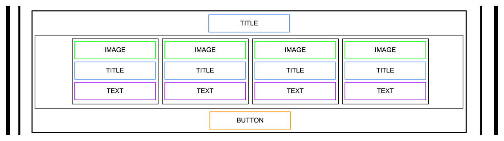

# Atlas Web Development - HTML Advanced

This project includes an HTML structure for the web page layout, consisting of various sections like Header, Banner, Quote, Videos, Membership, FAQ, and Footer.

## Table of Contents 	🗂️

- [Project Overview](#project-overview)
- [Directory Structure](#directory-structure)
- [Sections](#sections)
  - [Header](#header)
  - [Banner](#banner)
  - [Quote](#quote)
  - [Videos](#videos)
  - [Membership](#membership)
  - [FAQ](#faq)
  - [Footer](#footer)

## Project Overview 📌

The project focuses on creating a well-structured HTML document with various sections to showcase different components of a web page. The sections include a header, banner, quote, videos, membership, FAQ, and a footer.

## Directory Structure 📚

```
atlas-web-development/
| -- html_advanced/
|   | -- index.html
|   | -- images/
|   | -- | -- ...
```

## Header 📢

The header section includes a logo and the block of three navigation links.


## Banner 🖼️

The banner section consists of two blocks: one with a heading, text, and a button, and another with four blocks containing images, headings, and text.


## Quote 🧵

The quote section features an image, a quote tag, an author quote, and additional text.


## Videos 📽️

The videos section includes a heading and a block of four video items, each with an image, heading, text, author block, and rating block.


## Membership 💸

The membership section includes a heading and a block with four items, each containing an image, heading, text, and a button.



## FAQ ❓

The FAQ section comprises a block with two row blocks, each with two item blocks, including a heading and text.


## Footer 🎯

The footer section includes a block with an image and another block with images linked to social media, along with additional text.


<br />

### 🎨 <em><b>For styling and additional functionality, CSS and JavaScript will be added in future projects<b><em>.

### End product

